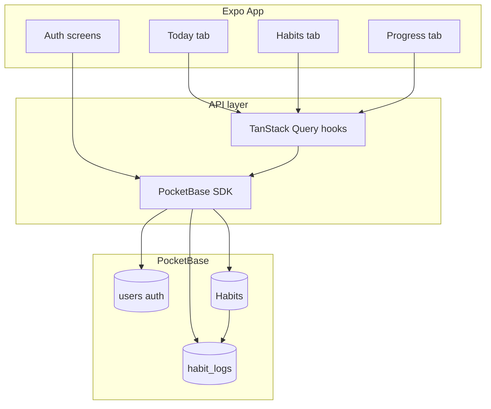

<p align="center">
  
  
</p>

<p align="center">
  A calm, premium habit &amp; routine tracker for iOS and Android — built with Expo and PocketBase.
</p>

<p align="center">
  
</p>

<p align="center">
  <a href="LICENSE"></a>
  
  
  
</p>

---

## What is Bloom?

**Bloom** helps you build better daily routines. Create habits, check them off on **Today**, manage your library on **Habits**, and review consistency on **Progress** — all in a single codebase that feels native on both iOS and Android.

Design north star: **Calm Focus** — the task is the hero, chrome stays quiet, and one accent color (Signal Blue) does the pointing. See [`PRODUCT.md`](PRODUCT.md) and [`DESIGN.md`](DESIGN.md) for the full design system.

<p align="center">
  
  &nbsp;&nbsp;
  
</p>

---

## Features

### Today — your daily checklist

- Habits due **today** are grouped by time of day (morning, afternoon, evening, night)
- Tap to complete; progress syncs to PocketBase via `habit_logs`
- At-a-glance cards for **today’s completion %** and **weekly insight**
- Collapsing large-title header with smooth compact-title transition

### Habits — your library

- Create and edit habits with schedule, routine, reminders, and optional notes
- Filter by routine (morning / afternoon / evening / night) and status (active / inactive)
- Search habits by name
- Bottom sheet form for quick creation

### Progress — consistency report

- **Today** completion ring
- **This week** day strip with current & best streak
- **30-day consistency** percentage
- **Up next** — computed next due dates from each habit’s schedule
- **Recent activity** feed from completion logs

### Settings & profile

- Profile editing (name, email, bio)
- Appearance (light / dark / system)
- Secure sign-out

### Authentication

- Email + password sign-up and sign-in
- Session stored securely (Secure Store on native)
- Per-user data isolation via PocketBase auth rules

---

## Screens & navigation

| Tab / area   | Route                 | Description                      |
| ------------ | --------------------- | -------------------------------- |
| **Today**    | `/(app)/today`        | Daily checklist + stat cards     |
| **Habits**   | `/(app)/habits`       | Habit library, search, filters   |
| **Progress** | `/(app)/progress`     | Streaks, rings, up-next, history |
| **Settings** | `/(screens)/settings` | Profile, appearance, account     |
| **Sign in**  | `/(auth)/sign-in`     | Auth entry                       |

Native tab bar uses SF Symbols on iOS and Material icons on Android.

---

## Tech stack

| Layer              | Technology                                                                                                                                |
| ------------------ | ----------------------------------------------------------------------------------------------------------------------------------------- |
| **Framework**      | [Expo SDK 57](https://docs.expo.dev/) + [Expo Router 7](https://docs.expo.dev/router/introduction/)                                       |
| **UI**             | React Native 0.86, [HeroUI Native](https://heroui.com/docs/native), [Uniwind](https://docs.uniwind.dev/) (Tailwind v4)                    |
| **Icons**          | [Hugeicons](https://hugeicons.com/) (free set)                                                                                            |
| **Forms**          | [TanStack Form](https://tanstack.com/form) + [Zod](https://zod.dev/)                                                                      |
| **Data fetching**  | [TanStack Query](https://tanstack.com/query)                                                                                              |
| **Backend**        | [PocketBase](https://pocketbase.io/) (self-hosted)                                                                                        |
| **Animation**      | [Reanimated 4](https://docs.swmansion.com/react-native-reanimated/), [react-native-ease](https://github.com/appandflow/react-native-ease) |
| **Lists / sheets** | FlashList, Gorhom Bottom Sheet                                                                                                            |

---

## Architecture



**Data model (summary)**

| Collection   | Purpose                                                                  |
| ------------ | ------------------------------------------------------------------------ |
| `users`      | Auth + profile (`name`, `email`, `bio`, …)                               |
| `Habits`     | Habit definitions — schedule, routine, reminders                         |
| `habit_logs` | Daily completions (`user`, `habit`, `date`, `completed`, `completed_at`) |

Schedule logic (daily / weekly / monthly) lives in [`src/features/progress/lib/schedule.ts`](src/features/progress/lib/schedule.ts) and mirrors the PocketBase “due today” filter.

---

## Prerequisites

- **Node.js** 20+ and npm
- **iOS**: Xcode 16+ (macOS) for simulator or device builds
- **Android**: Android Studio with SDK 35+
- **Expo**: [development build](https://docs.expo.dev/develop/development-builds/introduction/) recommended (Native Tabs, blur, secure store)
- **PocketBase**: binary installed via project script (see below)

---

## Getting started

### 1. Clone and install

```bash
git clone <your-repo-url> bloom
cd bloom
npm install
```

### 2. Install PocketBase

Downloads the correct binary for your OS:

```bash
npm run pocketbase:setup
```

### 3. Environment variables

Copy the example env file and adjust if needed:

```bash
cp .env.example .env.local
```

| Variable                     | Description                                                                                                                                    |
| ---------------------------- | ---------------------------------------------------------------------------------------------------------------------------------------------- |
| `EXPO_PUBLIC_POCKETBASE_URL` | PocketBase base URL (no trailing slash). Default `http://127.0.0.1:8090` — the app rewrites loopback to your Metro LAN IP on physical devices. |

Optional seed credentials (for `npm run pocketbase:seed`):

| Variable        | Description            |
| --------------- | ---------------------- |
| `SEED_EMAIL`    | Seed user email        |
| `SEED_PASSWORD` | Seed user password     |
| `SEED_NAME`     | Seed user display name |

> Restart Metro after changing env vars: `npx expo start --clear`

### 4. Start PocketBase

In one terminal:

```bash
npm run pocketbase
```

- REST API: `http://127.0.0.1:8090/api/`
- Admin UI: `http://127.0.0.1:8090/_/`

Migrations in [`pb_migrations/`](pb_migrations/) run automatically on first start.

### 5. Start the app

In another terminal:

```bash
npm start
```

Then press `i` (iOS simulator), `a` (Android emulator), or scan the QR code with a development build.

**Physical device tip:** PocketBase binds to `0.0.0.0:8090`. Keep `EXPO_PUBLIC_POCKETBASE_URL` as loopback in `.env.local` and let the app resolve your machine’s LAN IP, or set `http://<your-mac-lan-ip>:8090` explicitly.

### 6. (Optional) Seed sample habits

```bash
npm run pocketbase:seed
```

---

## Available scripts

| Script                     | Description                   |
| -------------------------- | ----------------------------- |
| `npm start`                | Start Expo dev server         |
| `npm run ios`              | Run on iOS                    |
| `npm run android`          | Run on Android                |
| `npm run web`              | Run in web browser            |
| `npm run lint`             | ESLint                        |
| `npm run pocketbase`       | Start PocketBase on port 8090 |
| `npm run pocketbase:setup` | Download PocketBase binary    |
| `npm run pocketbase:seed`  | Seed demo user + habits       |

---

## Project structure

```
bloom/
├── assets/
│   ├── images/          # App icon, splash, illustrations, tab icons
│   ├── icons/           # SVG doodles + React icon components (HabitDoodle, BloomDoodle)
│   └── expo.icon/       # iOS app icon asset
├── pb_migrations/       # PocketBase schema migrations
├── scripts/             # PocketBase setup & seed
├── src/
│   ├── app/             # Expo Router routes
│   │   ├── (app)/       # Main tabs: today, habits, progress
│   │   ├── (auth)/      # sign-in, sign-up
│   │   └── (screens)/   # settings, habit detail, edit profile
│   ├── api/             # PocketBase clients, types, React Query hooks
│   ├── components/      # Shared UI (headers, progress ring, search, …)
│   ├── features/        # Feature modules
│   │   ├── today/
│   │   ├── habits/
│   │   ├── progress/
│   │   ├── settings/
│   │   └── auth/
│   ├── hooks/
│   └── utils/
├── PRODUCT.md           # Product context & principles
├── DESIGN.md            # Visual tokens & components
└── AGENTS.md            # Agent / contributor conventions
```

---

## Assets & branding

Assets live under [`assets/`](assets/) and are re-exported from TypeScript where useful:

```tsx
import { AppIcon, HabitsIcon, HabitCycleIcon } from "@/assets/images";
import { BloomDoodle, HabitDoodle } from "@/assets/icons";
```

The wordmark is the [`BloomDoodle`](assets/icons/BloomDoodle.tsx) component — a React Native SVG used in-app and exported as static SVGs for docs. README uses GitHub’s [`#gh-light-mode-only` / `#gh-dark-mode-only`](https://github.blog/changelog/2021-11-24-specify-theme-context-for-images-in-markdown/) fragments so the ink stays visible in both themes.

| Asset                         | Path                                    | Use                            |
| ----------------------------- | --------------------------------------- | ------------------------------ |
| **Bloom wordmark (light bg)** | `assets/icons/bloom-logo.svg`           | README / marketing — Ink fill  |
| **Bloom wordmark (dark bg)**  | `assets/icons/bloom-logo-dark.svg`      | README / marketing — Snow fill |
| **BloomDoodle (RN)**          | `assets/icons/BloomDoodle.tsx`          | In-app logo (`color` prop)     |
| App icon                      | `assets/images/icon.png`                | Store / launcher icon          |
| Splash                        | `assets/images/splash-icon.png`         | Splash screen                  |
| Habits illustration           | `assets/images/noun-habits-4735592.png` | Marketing / empty states       |
| Habit doodle (SVG)            | `assets/icons/habit-doodle.svg`         | Empty state illustration       |
| Habit cycle                   | `assets/images/icons8-habit-64.png`     | UI accent icon                 |

<p align="center">
  
  
  &nbsp;&nbsp;&nbsp;
  
</p>

Android adaptive icons: `assets/images/android-icon-foreground.png`, `android-icon-background.png`, `android-icon-monochrome.png`.

---

## Design system

Bloom follows **Calm Focus**:

- **Signal Blue** accent — one primary action per screen
- System typography (SF Pro / Roboto)
- Soft surfaces, generous spacing, native blur headers
- Light & dark mode via Uniwind / HeroUI theme

Before UI work, read [`PRODUCT.md`](PRODUCT.md) and [`DESIGN.md`](DESIGN.md). Expo SDK docs: [expo.dev/versions/v57.0.0](https://docs.expo.dev/versions/v57.0.0/).

---

## Development notes

### Auth & security

- PocketBase auth token persisted with `expo-secure-store` on native
- Collection rules scope habits and logs to `@request.auth.id`

### Habit schedules

| Frequency   | Due when                                                |
| ----------- | ------------------------------------------------------- |
| **Daily**   | Every day after `start_date`                            |
| **Weekly**  | Selected weekdays in `weekly_days`                      |
| **Monthly** | Day of month in `monthly_day` (clamped to month length) |

### Progress metrics

Computed client-side from `habit_logs` + active habits:

- Today completion %
- Weekly day strip (done / partial / missed / future)
- Current & best streak (perfect scheduled days)
- 30-day consistency ring
- Up-next dates via `nextDueDate()`

### Linting

```bash
npm run lint
```

---

## Roadmap (not yet built)

- Per-habit detail report (streaks, history calendar)
- Monthly heatmap
- Push notification reminders
- Habit categories
- Web production deployment

See [`project.md`](project.md) for the original product vision.

---

## Contributing

1. Fork the repository
2. Create a feature branch (`git checkout -b feature/my-change`)
3. Commit your changes
4. Open a pull request

Please match existing patterns: feature folders under `src/features/`, PocketBase migrations for schema changes, and Calm Focus design principles.

---

## License

This project is licensed under the **MIT License** — see [LICENSE](LICENSE).

---

<p align="center">
  
  
  <br />
  <sub>Built with Expo · PocketBase · HeroUI Native</sub>
</p>
